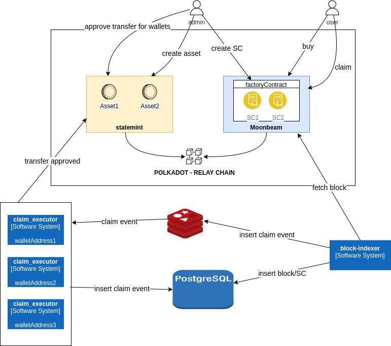

# Intro

## Ryu-project - on-chain
The on-chain part of the Ryu project runs on the Polkadot network. The main principle of Polkadot is based on the relay chain and connected parachains. More information about that you can find [here](https://wiki.polkadot.network/docs/learn-architecture). For the ryu-project we are using moonbeam and statemint parachain. [Moonbeam](https://moonbeam.network) is a parachain that is used to write smart contracts on the Polkadot network. [Statemint](https://wiki.polkadot.network/docs/build-integrate-assets) is a parachain that will be used only for asset management. 
For the ryu-project, we are using two smart contracts. FactoryContract and SaleContract. FactoryContract is used only to create SaleContracts. A SaleContract is a vesting contract through which users can purchase assets. Each SaleContract represents one asset. When vesting starts, users can claim their tokens. Currently, Cross-chain communication is not developed to the extend we would need to transfer purchased statemint assets on the moonbeam smart contract to the users account, so there comes Ryu-backend.

## Ryu-backend
Ryu backend serves as a bridge between moonbeam Ryu contracts and statemint assets. Ryu backend has two services. Blocks-indexer and claim_executor. Block indexer reads users claim actions from moonbeam parachain, and stores them into redis queue. Claim_executor then transfers claimed amount of tokens from the owner of the asset to the user. More information about block-indexer you can find [here](./block-indexer.md), and for the claim-executor [here](./claim-executor.md)